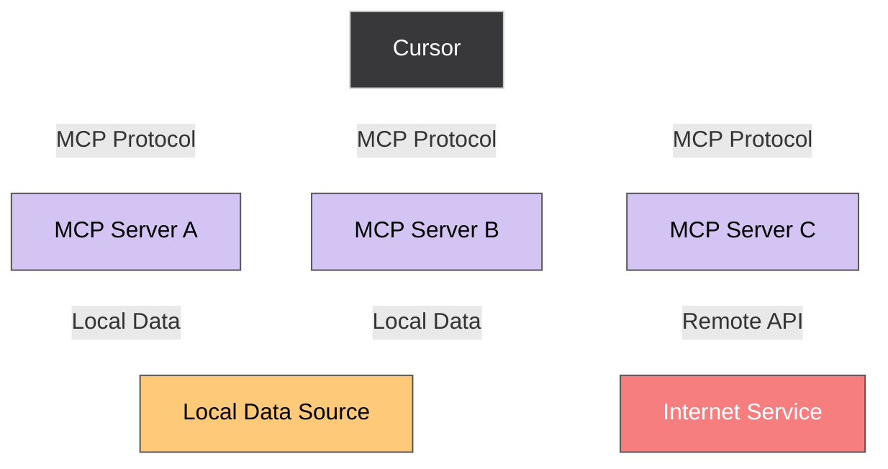

  
  
Welcome to The Denver Cursor meet up!

---

# Welcome

- **Cole McIntosh** – Host & Cursor Ambassador
- **Thanks to Bambei Brewing** for hosting us! 🍻 
- **Event**: [lu.ma/ivrgld91](https://lu.ma/ivrgld91)

---

# Agenda

1. **Welcome & Introductions**
2. **Hands-on Cursor Essentials** – Everyday workflows  
3. **What is MCP?** – How MCP supercharges productivity  
4. **Building in the Future** – Quick demo with Cursor  
5. **Networking & Community**

---

# What is Cursor?

**Smart AI Assistant**  
Suggests fixes and improvements as you type

**Plain English Coding**  
Describe what you want and Cursor writes it for you

**Project-Wide Intelligence**  
Understanding of your entire codebase

**Automates Boring Stuff**  
Refactors, adds tests, and updates docs in seconds

**Chat with Your Code**  
Ask "What does this function do?" and get instant answers

**Ship Faster**  
Focus on ideas, not syntax and boilerplate

---

# Vibe Coding

- **Describe, don't type**  
  Boss the AI around – it magically turns your chaotic thoughts into working code!
- **Stay in flow**  
  Get your zen on: Let cosmic vibes direct while AI tackles the tedious junk.
- **Prototype instantly**  
  Brainwave to browser in a flash – chit-chat tweaks, zero drama!
- **Balance AI & expertise**  
  Let AI handle the dirty work, then heroically swoop in to perfect it like a coding rockstar.

---

# What is MCP?

  <h2 class="text-xl opacity-70">MCP = Model Context Protocol</h2>

**Pull Live Data**  
Get real-time info from GitHub PRs, Slack messages, or your database

**Smart Context**  
AI knows what's happening right now, not just your code

**Take Actions**  
Create tickets, deploy code, update documentation automatically

**Stay in Flow**  
No more switching between 10 different tools and tabs

---

# How MCP Works

---

# Real-World MCP Examples

  

    

      

        
GitHub Integration

        
“Show me all PRs mentioning authentication”

        
Gets live PR data with current status

      

      

        
Slack Context

        
“What did the team say about the auth bug?”

        
Pulls recent relevant conversations

      

    

    

      

        
Linear Workflow

        
“Create a ticket for this bug and assign it to Sarah”

        
Creates ticket automatically with code context

      

      

        
Database Insights

        
“How many users signed up this week?”

        
Queries live production data safely

      

    

  

---

# Live Demos & $100 Cursor Credits Raffle

- **Raffle App Speed Build (Kickoff Demo)**  
  Watch a live, rapid-fire build of a raffle picker using Cursor.
- **Who’s in the Raffle?**  
  Every registered attendee—yes, even the waitlist—is automatically entered.
- **Community Showcases**  
  Three lightning demos from builders showing off what they’ve created with Cursor.
- **Random Winner Selection**  
  Our freshly minted app will choose one lucky name for the $100 credit prize.

---

# Tips for Maximum Productivity

  

### **Master Keyboard Shortcuts**
- <code class="bg-white text-black rounded px-2 py-1 font-mono">Cmd+K</code> for quick actions
- <code class="bg-white text-black rounded px-2 py-1 font-mono">Cmd+L</code> to chat with codebase  
- Moving fast = thinking fast = building fast

### **Leverage MCP Connections**
- Pull live data from GitHub, Slack, Linear
- Take actions without leaving your editor
- Every context switch breaks your flow

### **Custom Rules & Instructions**
- Define your coding style once, use everywhere
- Automate repetitive agent requests
- Essential for consistent agent workflows

### **Use Different Models**
- Use o3 or Grok 4 for planning
- Use Claude 4 for execution
- Use Gemini for reviewing

---

# Join the Cursor Community

  Find local meetups: <a href="https://cursor.com/community" class="text-blue-400 hover:underline">cursor.com/community</a>

---

# Thank You

## Questions? Let's connect!

**X**: https://x.com/colesmcintosh
 
**GitHub**: https://github.com/colesmcintosh
 
**LinkedIn**: https://www.linkedin.com/in/colemcintosh/

<small>© Cursor Community</small>

---

  <h2 class="text-3xl font-bold mb-4">Access the Slides</h2>
  
  <a href="https://colesmcintosh.github.io/cursor-slidev/" class="text-xl hover:underline text-blue-400">colesmcintosh.github.io/cursor-slidev</a>

 